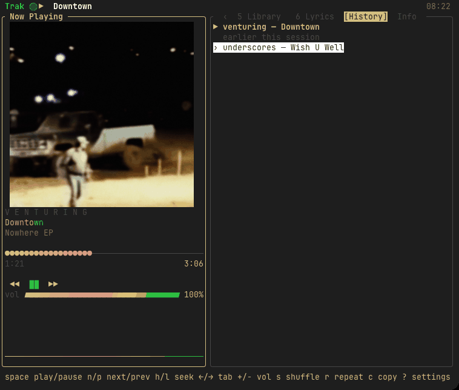
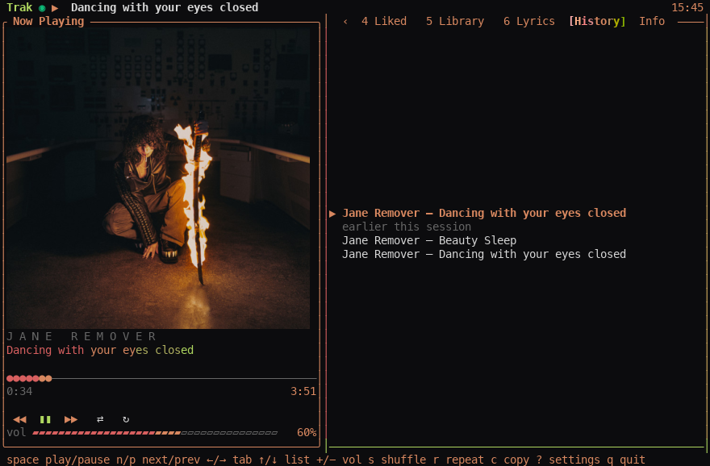
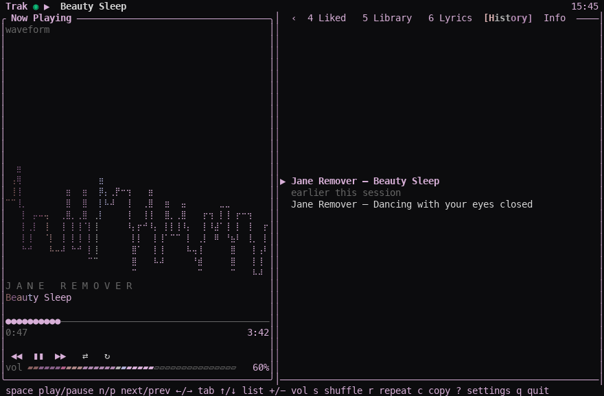
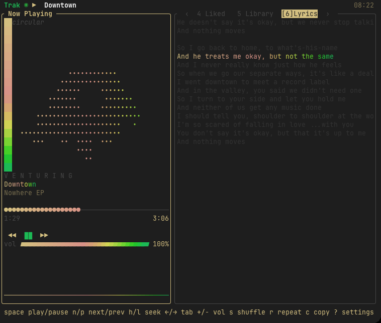
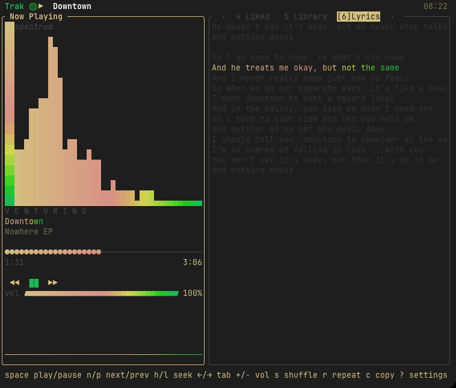
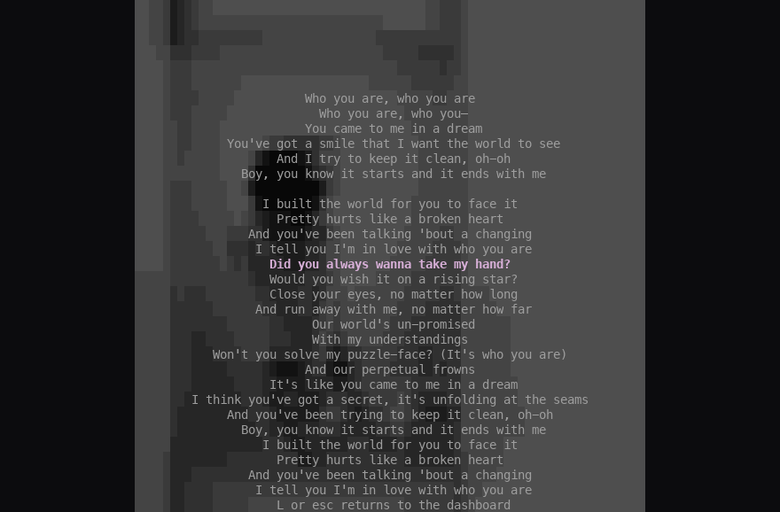
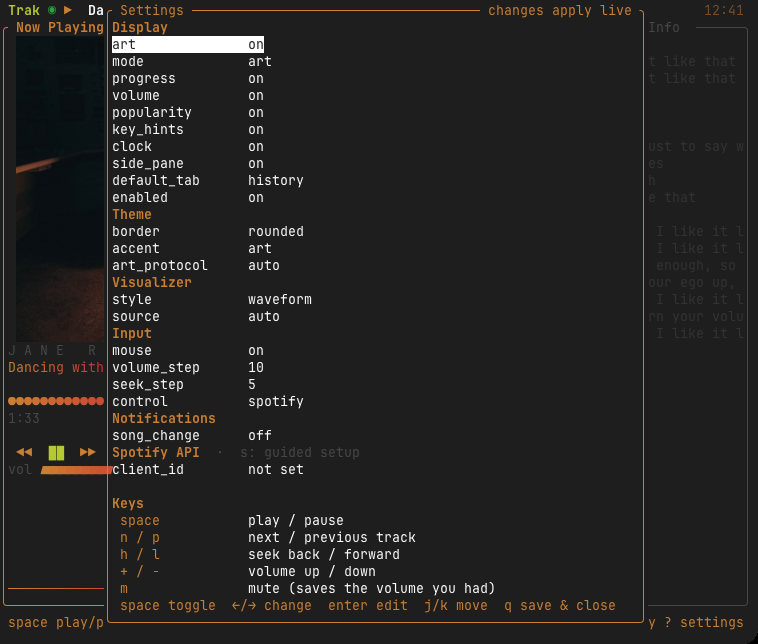

<div align="center">
  <h1>Trak</h1>
  <p><strong>A fast, good-looking terminal UI for Spotify on macOS.</strong></p>
  <p>Now playing, album art or a live visualizer, synced lyrics, and every <a href="https://github.com/hnarayanan/shpotify">shpotify</a> command. It controls the official Spotify app, so the Free tier works with no setup.</p>
</div>

<p align="center">
  <a href="https://github.com/Kathir-D/Trak/actions/workflows/ci.yml"></a>
  <a href="https://github.com/Kathir-D/Trak/releases"></a>
  <a href="#install"></a>
  
  
  <a href="LICENSE"></a>
  
</p>

<p align="center">
  
  <br><sub>Version B (no Client ID, Free account) in <a href="https://cmux.dev">cmux</a>, which draws the cover with the Kitty graphics protocol.</sub>
</p>

> **Status: pre-alpha.** Everything below describes what is built and tested. One part has not
> met a real account yet and is marked **unverified**: the Spotify Web API tabs (they need a
> Client ID and a first live login).

**Contents:** [Why Trak](#why-trak) · [Features](#features) · [Install](#install) ·
[Screenshots](#screenshots) · [The TUI](#the-tui) · [Version A and B](#version-a-and-b) · [Settings](#settings) ·
[One-shot commands](#one-shot-commands) · [Permissions](#permissions) ·
[Works with Sonar and headless-spotify](#made-for-a-headless-setup) · [Credits](#credits)

## Why Trak

- **It controls the app you already have.** Trak talks to the official Spotify desktop app through
  AppleScript, so the **Free tier works with zero setup** — no account linking, no developer app.
- **It is a real interface, not just commands.** Now playing, album art in the terminal, synced
  lyrics, a visualizer, and the whole of [shpotify](https://github.com/hnarayanan/shpotify)'s
  command set for scripts.
- **It is polite.** It never launches Spotify as a side effect, writes only in answer to a key you
  pressed, and coexists with [Sonar](https://github.com/Kathir-D/Sonar) and
  [headless-spotify](https://github.com/Kathir-D/headless-spotify).

## Features

| | |
| --- | --- |
| 🎧 **Now Playing** | title, artist, album, progress bar you can click, volume meter, shuffle and repeat |
| 🖼 **Album art** | in kitty, iTerm2, sixel or half-block terminals (negotiated at start); the accent colour is taken from the cover |
| 📜 **Synced lyrics** | from [LRCLIB](https://lrclib.net), follow the song, with a full-screen page on `L` |
| 📊 **Visualizer** | four styles (`v`), 30 fps while visible, from Spotify's own audio (a Core Audio tap on Spotify alone, never the rest of the system); simulated if the tap is unavailable |
| 🕘 **History and Info** | tracks played this session; everything AppleScript exposes about the current track |
| ⚙️ **Settings** | `,` or `?` (or `trak config`): a checklist where changes apply live, with every key beside it |
| 🔎 **Search, playlists, queue, library** | optional, with a Spotify Client ID (**unverified** against a live account) |
| 🔌 **Plays well with others** | shows Sonar's ducking, detects headless-spotify, never fights either |
| ⌨️ **shpotify's commands** | `trak play`, `vol`, `status --json` and the rest, for scripts |

## Install

Needs macOS 14.2 or newer and the Spotify desktop app. Trak is a command, not an app, so it
installs as a Homebrew **formula** (no `--cask`):

```sh
brew install kathir-d/tap/trak
trak                 # the TUI
trak status          # one-shot
```

Upgrade with `brew update && brew upgrade kathir-d/tap/trak`; remove with `brew uninstall trak`.

Without Homebrew, the installer downloads the same release, checks its SHA-256 and puts `trak` in
`/usr/local/bin` (if writable) or `~/.local/bin`. It never uses `sudo`:

```sh
curl -fsSL https://raw.githubusercontent.com/Kathir-D/Trak/main/install.sh | sh
curl -fsSL https://raw.githubusercontent.com/Kathir-D/Trak/main/install.sh | sh -s -- --uninstall
```

The binary is universal (Apple silicon and Intel) and ad-hoc signed, not notarized. Neither path
sets the quarantine flag, so macOS shows no Gatekeeper prompt. The first command that talks to
Spotify asks your terminal for Automation permission, once ([Permissions](#permissions)).

From source, with a recent stable Rust:

```sh
git clone https://github.com/Kathir-D/Trak && cd Trak
cargo build --release
./target/release/trak
```

`cargo test` runs with no Spotify, no network and no audio device.

## Screenshots

<details>
<summary>Dashboard, visualizer styles, full-screen lyrics, settings</summary>

| | |
| --- | --- |
|  |  |
| Dashboard with the cover and the session history | `waveform` visualizer beside synced lyrics |
|  |  |
| `circular` | `spectrum` |
|  |  |
| Full-screen lyrics (`L`) | Settings (`,` or `?`) |

</details>

## The TUI

Run `trak` with no arguments. The layout adapts to the terminal: Now Playing on the left, tabs on
the right, collapsing to a compact strip when it gets small.

| Key | Action |
| --- | --- |
| `space` | play / pause |
| `n` / `p` | next / previous |
| `h` / `l` | seek −/+ (5 s, a setting) |
| `←` / `→` | previous / next tab |
| `+` `-` | volume ±10 (a setting) |
| `m` | mute (and back to the volume you had) |
| `s` / `r` / `R` | shuffle / repeat off → all → one / replay the track |
| `a` / `v` | art ↔ visualizer / next visualizer style |
| `j` `k` `enter` | move in a list / play the selection |
| `tab` `shift-tab`, `1`–`6` | change tab |
| `L` | full-screen lyrics |
| `c` | copy the track's share link |
| `,` or `?` | settings, with every key listed beside them |
| `q` | quit |

With a Client ID there are more: `/` search, `A` add to queue, `f` like the playing track, `o`
open an artist or album, `P` add to a playlist, `X` remove from the open playlist.

## Version A and B

| | **B** — no setup | **A** — with a Client ID |
| --- | --- | --- |
| Needs | the Spotify desktop app | the desktop app **and** a free Spotify developer app |
| Works on Free | yes | search, library and playlists yes; add-to-queue needs Premium (Spotify's rule) |
| Now Playing, art, lyrics, visualizer, history, CLI | ✅ | ✅ |
| Search, playlists, queue, liked songs, library | tabs explain what to add | ✅ *(unverified live)* |

To switch to A: press `,` inside Trak (or run `trak config`), then `s` for the guided setup. It
walks you through it in four steps, and copies the one string you have to paste:

1. Open the [Spotify developer dashboard](https://developer.spotify.com/dashboard) and press
   **Create app**.
2. Paste this into **Redirect URI** — exactly, it must match:
   ```
   http://127.0.0.1:8888/callback
   ```
   Tick **Web API**, press **Save**. (`localhost` is rejected by Spotify, and so is the
   port-less form `http://127.0.0.1`.)
3. Open the app's **Settings** page and paste the **Client ID** — the 32 letters and numbers.
4. Press enter and **Allow** in the browser.

Trak keeps the token in `~/.config/trak/token.json` with mode `0600`; see
[`SECURITY.md`](SECURITY.md). The account that creates the app needs Spotify **Premium**, and
Spotify's development mode limits an app to a handful of users, so each person creates their own.
`?` lists every key; `q` saves and closes.

## Settings

`~/.config/trak/config.toml` (`XDG_CONFIG_HOME` is respected). Unknown keys are ignored, missing
keys take defaults, and a corrupt file is renamed to `config.toml.bak`.

<details>
<summary>Every key and its default</summary>

| Section | Key | Values (default first) |
| --- | --- | --- |
| `[display]` | `art`, `progress`, `volume`, `popularity`, `key_hints`, `clock`, `side_pane` | `true` / `false` |
| | `mode` | `art`, `visualizer` |
| | `default_tab` | `history`, `info`, `lyrics`, `search`, `playlists`, `queue`, `liked`, `library` |
| | `border` | `rounded`, `sharp`, `double`, `none` |
| | `accent` | `art`, `green`, `terminal` |
| | `art_protocol` | `auto`, `kitty`, `iterm2`, `sixel`, `halfblocks` |
| `[visualizer]` | `style` | `spectrum`, `mirrored`, `waveform`, `circular` |
| | `source` | `auto` (real audio, falling back to simulated), `simulated` |
| `[input]` | `mouse` | `true`, `false` |
| | `volume_step`, `seek_step` | `10`, `5` |
| `[notifications]` | `song_change` | `false`, `true` |
| `[lyrics]` | `enabled` | `true`, `false` |
| `[spotify]` | `client_id` | `""` (Version B) |

</details>

`NO_COLOR=1` removes colour from the TUI and the CLI; terminals without 24-bit colour get the
nearest 256- or 16-colour approximation.

## One-shot commands

```sh
trak status                 # a card of what is playing
```

```
▶
Census Designated
Jane Remover · Census Designated
1:35 / 6:00
volume 100
```

On a terminal that also gets a progress bar and a volume meter, and the artist's name in bold.
Piped or redirected, the same command prints clean text with no escape codes — so
`trak status | cat` is safe to put in a script.

### Every command

| Command | What it does | Output |
| --- | --- | --- |
| `trak status` | the card above | |
| `trak status --json` | machine readable | one JSON object, below |
| `trak status artist` | just the artist | `Jane Remover` |
| `trak status album` | just the album | `Census Designated` |
| `trak status track` | just the title | `Census Designated` |
| `trak play` | resume | *(silent)* |
| `trak play spotify:track:…` | play a URI — works on the Free tier | *(silent)* |
| `trak play <song>` | search and play the best match (needs the optional Client ID) | `Playing Teardrop — Massive Attack (Mezzanine)` |
| `trak play album <name>` | search albums, play the best match | `Playing Mezzanine — Massive Attack (1998)` |
| `trak play artist <name>` | search artists, play the best match | `Playing Massive Attack` |
| `trak play list <name>` | search playlists, play the best match | `Playing Massive Attack on Repeat · 3 tracks` |
| `trak play uri <uri>` | play a URI, spelt the way shpotify did | *(silent)* |
| `trak pause` | toggles play/pause, as shpotify's did | `Pausing Spotify.` / silent when already paused |
| `trak stop` | pause if playing; Spotify has no `stop` command | `Pausing Spotify.` / silent |
| `trak next` | skip | *(silent)* |
| `trak prev` | back | *(silent)* |
| `trak replay` | restart the track | *(silent)* |
| `trak pos 60` | seek to 1:00 | `1:00` |
| `trak vol up` | +10% | `90` — the volume after the step |
| `trak vol down` | −10% | `70` |
| `trak vol show` | print the current volume | `80` |
| `trak toggle shuffle` | toggle shuffle | *(silent)* |
| `trak toggle repeat` | cycle repeat off → all → one | *(silent)* |
| `trak share url` | print and copy the open.spotify.com link | `https://open.spotify.com/track/…` |
| `trak share uri` | print and copy the spotify: URI | `spotify:track:…` |
| `trak quit` | quit the Spotify app | *(silent)* |

`trak --help` lists them all. Exit codes are `0` on success, `1` on a runtime
failure, `2` on a usage or setup problem. Commands that write to Spotify print
nothing on success — the *next* `trak status` is the confirmation. The one
exception is a play by name, which prints the match it chose: you named a song
rather than a URI, and "the best match" is a decision worth seeing. It never
prints a miss as a success — nothing found is `No results when searching for
"…"`, exit 1.

Search is the optional Client ID's too: `trak play <song>` and friends need the
one-time setup (`trak config`, the steps it prints), which no machine has walked
yet — until then those commands print the setup steps and exit 2, exactly as
shpotify did before its user configured an app.

### JSON

```sh
trak status --json
```

```json
{"state":"▶","title":"Census Designated","artist":"Jane Remover","album":"Census Designated","album_artist":"Jane Remover","uri":"spotify:track:6HacgXCExkzS552ILfJTXu","duration_ms":360511,"position_secs":95.196,"volume":100,"shuffling":false,"repeating":true,"popularity":48,"track_number":8,"disc_number":1,"artwork_url":"https://i.scdn.co/image/ab67616d0000b2738a821784ac3e69e691d4945f","is_ad":false}
```

## Permissions

The first AppleScript call asks your terminal for permission to control Spotify.
If it is denied, Trak says so and tells you where to fix it:

> System Settings › Privacy & Security › Automation › add your terminal, with
> Spotify checked.

That prompt belongs to your **terminal**, not to Trak, so it happens once per
terminal. Trak never starts Spotify as a side effect; it only talks to an app you
already have running.

The visualizer taps Spotify's audio only while it is on screen. On the Macs tested
so far macOS asks for nothing; if it ever refuses, the bars fall back to a simulated
spectrum and Trak says once where to allow it:

> System Settings › Privacy & Security › Screen & System Audio Recording › your
> terminal.

## Made for a headless setup

Works alongside [Sonar](https://github.com/Kathir-D/Sonar) (menu-bar skip/prev
and auto-pause) and [headless-spotify](https://github.com/Kathir-D/headless-spotify)
(Spotify with no Dock icon). The contract Trak keeps with both is written down in
[`docs/COMPAT.md`](docs/COMPAT.md) and the details that are easy to get wrong are
measured in [`docs/APPLESCRIPT.md`](docs/APPLESCRIPT.md).

## For contributors and agents

Start with [`AGENTS.md`](AGENTS.md), then [`docs/SPEC.md`](docs/SPEC.md) and
[`TODO.md`](TODO.md). To re-check the measurements behind the design,
`./spikes/verify.sh` runs every spike and compares the result against the docs.

## Credits

Trak descends from [shpotify](https://github.com/hnarayanan/shpotify) by Harish
Narayanan (MIT). The visualizer is inspired by
[cava](https://github.com/karlstav/cava); its tap uses
[cidre](https://github.com/yury/cidre). See
[`THIRD-PARTY-NOTICES.md`](THIRD-PARTY-NOTICES.md).

## License

MIT. See [`LICENSE`](LICENSE).
